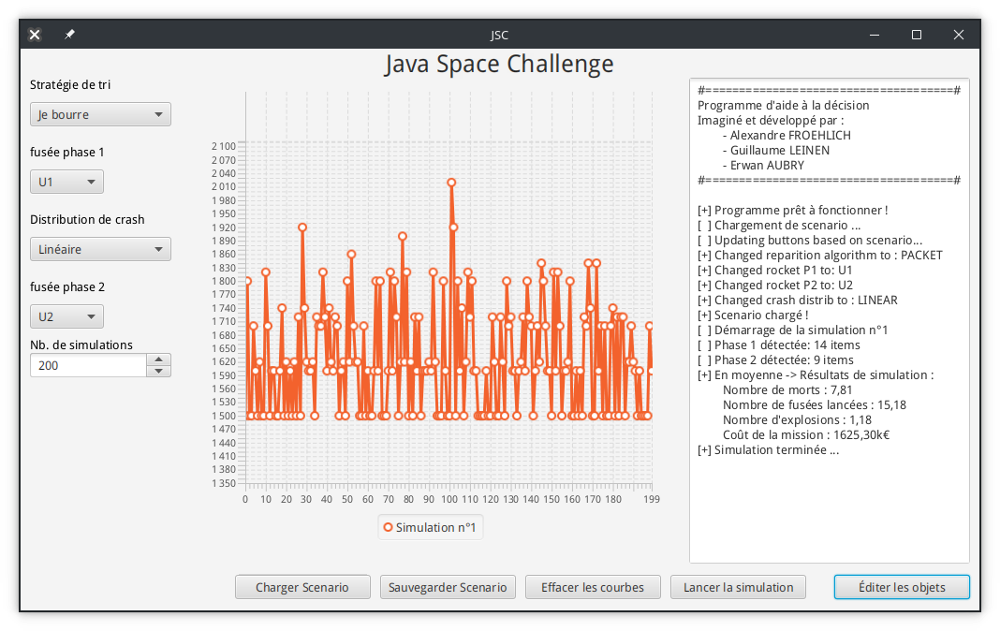

# Java Space Challenge


A decision making tool made by 3 students from the [ENSTA Bretagne](https://www.ensta-bretagne.fr/fr) Engineering school.

For the end of the semester project we tried to develop a decision making tool made in Java in a Space Agency management scenario. This project is called : "*Java Space Challenge*"


## Installation

First you need to clone the project :

```bash
cd /tmp
git clone https://github.com/NightlySide/JavaSpaceChallenge
cd JavaSpaceChallenge/
```

This project is built using maven and Java. In order to deploy this tool you need to install first Java (Instructions on [Oracle's website](https://www.java.com/en/download/help/download_options_fr.html)) then maven : 

```bash
# Debian / Ubuntu
sudo apt install maven

# Arch
sudo pacman -Syu maven
```

> If you happen to be on a Windows OS, we recommend you follow the installation step from the Apache Maven website [here](https://maven.apache.org/install.html).

Once Maven is installed, the next step is to download all the project's dependencies :

```bash
mvn install
```

Then you can package the project from the sources :

```bash
mvn package
```

Which produces a `.jar` file in the `target` folder

And you're done with the installation !

## Usage

This tool is a graphical decision making tool. Thus the command line is only required to start the application.

As the project is made using Java and all the project dependencies are bundled in the jar file using "shade" plugin, you only have to run : 

```bash
java -jar target/project-*.jar
```

And you should be greeted with this window :

