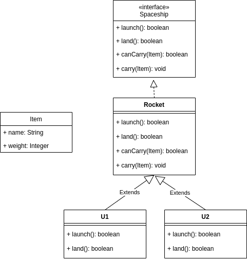

# Space Challenge

> Projet Java conçut par :
>
> - [Erwan AUBRY]()
> - [Alexandre FROEHLICH](https://nightlyside.github.io/)
>
> Dans le cadre des cours de Programmation Avancée et orienté objet en JAVA de l'ENSTA Bretagne

## Introduction

## PART 1: The design

## PART 2: The Simulation

## PART 3: Building a decision-making tool

